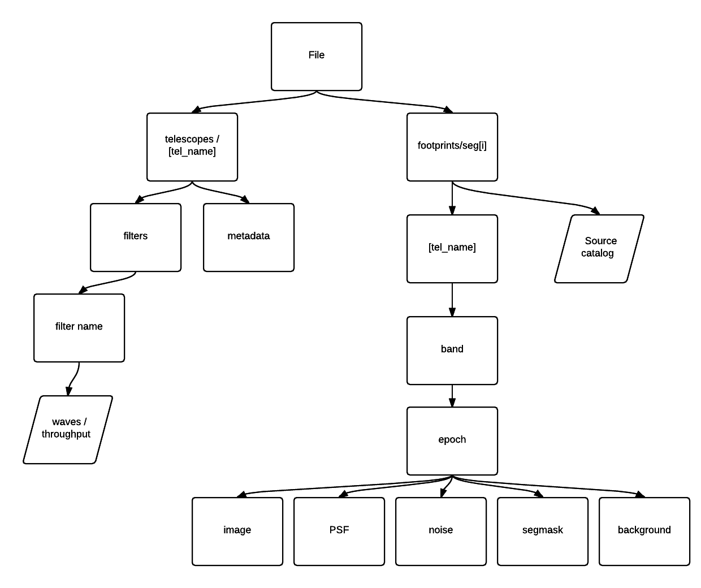

# footprints
Convert astronomical images to multi-epoch 'footprint' files for sources of interest.

A 'footprint' is a selection of image pixels that can be reasonably approximated as statistically independent from all other pixel collections in a large area astronomical image. That is, one may assume the likelihood functions factor for distinct footprints.

Footprints are the way that we split up large amounts of imaging data for source extraction or probabilistic source model inferences.

## Footprint file specification

## People

- William Dawson
- Michael D. Schneider
